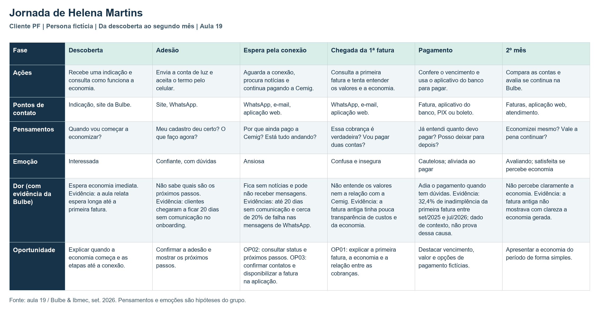

# Mapa de jornada do usuário

## Persona escolhida pelo grupo

**Helena Martins, 46 anos · Contagem (MG) · auxiliar administrativa**

> Persona fictícia: cliente pessoa física no primeiro mês de Bulbe. A jornada é uma hipótese do grupo, construída com os dados apresentados na aula 19.

- **Contexto:** Conheceu a Bulbe por indicação e aderiu pelo celular para economizar na conta de luz da residência. Ainda aguarda a conexão e continua pagando a Cemig.
- **Objetivo:** Entender quando a economia começa e pagar a primeira fatura corretamente.
- **Medos e dúvidas:** “Meu cadastro deu certo?”, “Vou pagar duas contas?”, “Como sei se essa cobrança é verdadeira?”
- **Canais:** Usa WhatsApp diariamente, consulta pouco o e-mail e ainda não baixou o aplicativo.

## Mapa

| Fase | Ações | Pontos de contato | Pensamentos | Emoção | Dor (com evidência da Bulbe) | Oportunidade |
| --- | --- | --- | --- | --- | --- | --- |
| Descoberta | Recebe uma indicação e consulta como funciona a economia. | Indicação, site da Bulbe. | Quando vou começar a economizar? | Interessada | Espera economia imediata. Evidência: a aula relata espera longa até a primeira fatura. | Explicar quando a economia começa e as etapas até a conexão. |
| Adesão | Envia a conta de luz e aceita o termo pelo celular. | Site, WhatsApp. | Meu cadastro deu certo? O que faço agora? | Confiante, com dúvidas | Não sabe quais são os próximos passos. Evidência: clientes chegaram a ficar 20 dias sem comunicação no onboarding. | Confirmar a adesão e mostrar os próximos passos. |
| Espera pela conexão | Aguarda a conexão, procura notícias e continua pagando a Cemig. | WhatsApp, e-mail, aplicação web. | Por que ainda pago a Cemig? Está tudo andando? | Ansiosa | Fica sem notícias e pode não receber mensagens. Evidências: até 20 dias sem comunicação e cerca de 20% de falha nas mensagens de WhatsApp. | OP02: consultar status e próximos passos. OP03: confirmar contatos e disponibilizar a fatura na aplicação. |
| Chegada da 1ª fatura | Consulta a primeira fatura e tenta entender os valores e a economia. | WhatsApp, e-mail, aplicação web. | Essa cobrança é verdadeira? Vou pagar duas contas? | Confusa e insegura | Não entende os valores nem a relação com a Cemig. Evidência: a fatura antiga tinha pouca transparência de custos e da economia. | OP01: explicar a primeira fatura, a economia e a relação entre as cobranças. |
| Pagamento | Confere o vencimento e usa o aplicativo do banco para pagar. | Fatura, aplicativo do banco, PIX ou boleto. | Já entendi quanto devo pagar? Posso deixar para depois? | Cautelosa; aliviada ao pagar | Adia o pagamento quando tem dúvidas. Evidência: 32,4% de inadimplência da primeira fatura entre set/2025 e jul/2026; dado de contexto, não prova dessa causa. | Destacar vencimento, valor e opções de pagamento fictícias. |
| 2º mês | Compara as contas e avalia se continua na Bulbe. | Faturas, aplicação web, atendimento. | Economizei mesmo? Vale a pena continuar? | Avaliando; satisfeita se percebe economia | Não percebe claramente a economia. Evidência: a fatura antiga não mostrava com clareza a economia gerada. | Apresentar a economia do período de forma simples. |

## Oportunidades registradas como Issues

- **OP01 — [#13: Explicar a primeira fatura e a economia](https://github.com/jgdosantos/202602-projeto1-a-01/issues/13):** chegada da 1ª fatura; esclarecer valores, economia e relação com a Cemig. Origem da HU01, associada à Issue #4 em [historias1.md](historias1.md).
- **OP02 — [#12: Linha do tempo pós-adesão](https://github.com/jgdosantos/202602-projeto1-a-01/issues/12):** adesão e espera pela conexão; mostrar status, etapas e próximos passos.
- **OP03 — [#11: Confirmar contatos com canal alternativo](https://github.com/jgdosantos/202602-projeto1-a-01/issues/11):** espera e chegada da 1ª fatura; conferir contatos e oferecer uma alternativa quando a mensagem não chegar.

> As três Issues possuem o label `oportunidade`, conforme a lista enviada pelo grupo. A inclusão no GitHub Projects ainda precisa ser conferida.

**Indicador principal:** pagamento da 1ª fatura.

**Fonte das evidências:** material da aula 19, *Etapa 2: Jornada do Usuário com o caso Bulbe Energia*, baseado na apresentação Bulbe & Ibmec de setembro de 2026. Emoções, pensamentos e comportamentos de Helena são hipóteses da persona.
